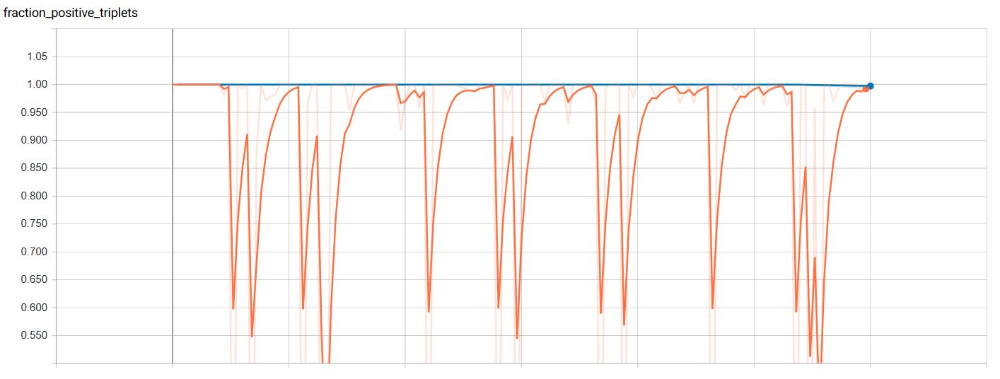
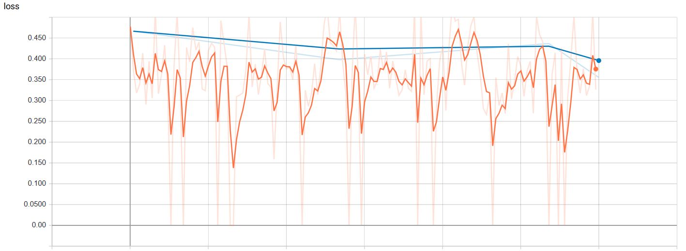

# FACE RECOGNITION WITH FACENET ARCHITECTURE

In this project, I implemented a deep learning solution (Facenet architecture) with the objective to recognise faces from a set of images.

For doing this project I used the following resources:

> Schroff, F., Kalenichenko, D., & Philbin, J. (2015). Facenet: A unified embedding for face recognition and clustering. In Proceedings of the IEEE conference on computer vision and pattern recognition (pp. 815-823).

> Moindrot, O. (Mar 19, 2018). Triplet Loss and Online Triplet Mining in TensorFlow. Olivier Moindrot blog. Recovered From: https://omoindrot.github.io/triplet-loss

> omoindrot. (Jan 28, 2019). tensorflow-triplet-loss. Github. https://github.com/omoindrot/tensorflow-triplet-loss

> Amos, B. (January 16, 2016). OpenFace 0.2.0: Higher accuracy and halved execution time. Brandon Amos blog. OpenFace 0.2.0. Recovered From: http://bamos.github.io/2016/01/19/openface-0.2.0/

> Coursera Courses. Deep Learning Specialization, Course 4: Convolutional Neural Networks. Triplet Loss Lecture. Recovered From: https://www.coursera.org/lecture/convolutional-neural-networks/triplet-loss-HuUtN 

> Gary B. Huang, Manu Ramesh, Tamara Berg, and Erik Learned-Miller. Labeled Faces in the Wild: A Database for Studying Face Recognition in Unconstrained Environments. University of Massachusetts, Amherst, Technical Report 07-49, October, 2007


## Project Structure

```
- tests/
    data.ipynb
    model.ipynb
    predictions.ipynb
- assets/
- config.py
- data.py
- model.py
- preprocessing.py
- requirements.txt
- trainer.py
- triplet_loss.py
- utils.py
```

The previous structure contains the following information:

* **tests:** This folder contain some Jupyter Notebooks used to validate the correct behavior of the different methods developed in the scripts.
* **assets:** This folder contains some screenshots that allow us to visualize the results in the project pipeline.
* **config:** This script contains the parameters' values used through the differents .py files.
* **data:** This script is in charge of reading and load the images, build the _input fn_ and define the data augmentation methods.
* **model:** This script defines a model function, loss function and accuracy metrics needed to track the model performance.
* **preprocessing:** This script contains the environment setup needed before training the model.
* **requirements.txt:** This file have the complete list of dependencies that you need to run the project.
* **trainer:** This file contains the script to train and validate the model defined.
* **triplet_loss:** This file contains the TensorFlow implementation of triplet loss. This implementatios was developed in totally by Oliver Moindrot.
* **utils:** This file contains some utility methods.

## Model specifications and results

For developed this project I based on FaceNet paper, the authors suggest two types of architectures, their practical differences lie in the difference of parameters and FLOPS. 

The first category used the standard convolutional layers of the Zeiler&Fergus architecture, this model is appropiate to run in a datacenter because it have many  parameters  and  require  a  large  number  of  FLOPS. . 

The second category is based on GoogLeNet style Inception models. These models have much less parameters and FLOPS, almost 20x fewer parameters and up to 5× fewer FLOPS, it is appropiate to run in mobil phones or computers with fewer characteristics. . 

For the second category they defined 5 different architectures, each one with different layers configuration and different images size.

I developed my own model architecture based on the second category and the first architecture that the authors propose.

**How is the complete model trained?** You can see the complete list of hyperparameters that I use for train the model in the  `config.yml` file. The more relevant parameters are.
* batch_size: 24
* distance_threshold: 1.242
* learning_rate: 0.001
* loss: Triplet Loss
* max_steps: 3000
* optimizer: Adam

### Results
* **Fraction Positive Triplets**


* **Training and Validation Loss**


* **Predictions in test set**


## How to use

This project is developed in Python 3 environment, you must install most dependencies added in the ```requirements.txt```with the following line in your terminal.

```
pip install -r requirements.txt
```

First of all, we need to clone the repository.
```
git clone https://github.com/SebasPelaez/face-recognition-facenet.git
```

Next, we move to the folder and execute the preprocessing script.
```
cd face-recognition-facenet
python preprocessing.py
```

This script executes 5 functions.

1. **download_data:** Creates the data directory and extract there the compressed file with the images from the dataset ```Labelled Faces in Wild```.
2. **extract_data:** Decompress the downloaded file.
3. **generate_label_json:** Build a dictionary with the name of each person and a number representing the class, then save it in a .json file.
4. **complete_data:** Search in all folders, which of them don't have a number of images equal to a multiple of 4, then generate the images that are needed to complete the multiple of 4.
4. **generate_datasets:** Creates 3 different .txt files with the classes distribution. One file for training, one for validation and one for test the model.

At this point, we have the environment ready to train the model. For do that you should execute this line of code.

```
python trainer.py -c config.yml
```

## Notes

* Verify if your enviroment have all recommended dependencies.
* Change the config.yml to adapt the project parameters of your PC capacities.


## TODO

- [x] Create a script to configure the environment.
- [x] Build Facenet architecture and _model fn_ function.
- [x] Create data management and _input fn_ function.
- [x] Code wrap function to execute the train and test process.
- [x] Make Jupyter Notebooks with the unit test of some script functions.
- [ ] Upload pre-trained weights.
- [x] Show metrics and model results.
- [x] Create a Jupyter Notebook with the test of predictions script.
- [ ] Make predictions with different face images.

_Feel free to make my comments, corrections or advice_